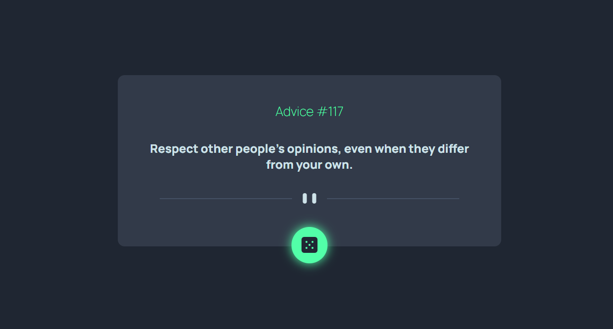

# Frontend Mentor - Advice generator app solution

This is a solution to the [Advice generator app challenge on Frontend Mentor](https://www.frontendmentor.io/challenges/advice-generator-app-QdUG-13db). Frontend Mentor challenges help you improve your coding skills by building realistic projects.

## Table of contents

- [Overview](#overview)
  - [The challenge](#the-challenge)
  - [Screenshot](#screenshot)
  - [Links](#links)
- [My process](#my-process)
  - [Built with](#built-with)
- [Author](#author)

## Overview
This project generates a motivational paragraph by clicking the dice button

### The challenge

Users should be able to:

- View the optimal layout for the app depending on their device's screen size
- See hover states for all interactive elements on the page
- Generate a new piece of advice by clicking the dice icon

### Screenshot

### Links

- Solution URL: [https://github.com/ivargasm/Advice-generator](https://github.com/ivargasm/Advice-generator)
- Live Site URL: [Add live site URL here](https://your-live-site-url.com)

## My process

First generate the layout with HTML and CSS and then export it to React + Vite to add the dynamic part.

### Built with

- Semantic HTML5 markup
- CSS custom properties
- Flexbox
- CSS Grid
- Mobile-first workflow
- [React](https://reactjs.org/) - JS library
- [Vite](https://vitejs.dev/) - JS

## Author

- Website - [Ismael Vargas Martinez](https://ivargasm.com)
- Frontend Mentor - [@ivargasm](https://www.frontendmentor.io/profile/ivargasm)
